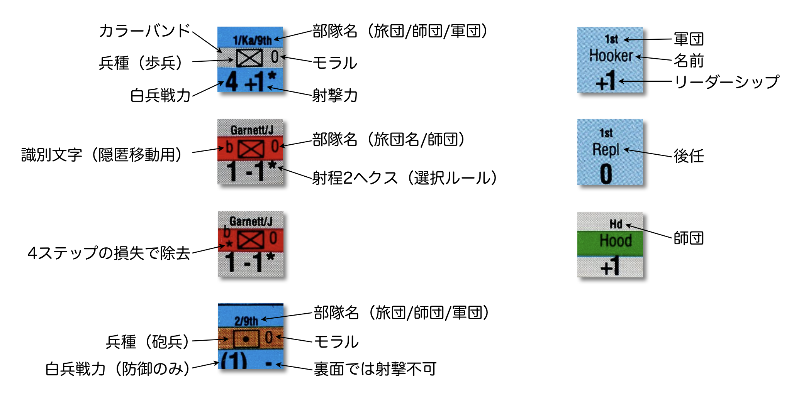

# South Mountain (West End Games)

## コマ

## プレイの手順
- 北軍プレイヤーターン
  - 移動フェイズ
    - 回復マーカー、砲兵攻勢射撃マーカーを配置
    - 戦闘ユニットの移動
    - リーダーユニットの移動
  - 防御射撃フェイズ
    - 射撃前退却（下馬騎兵、歩兵とスタックしている砲兵）
    - 非手番ユニットによる射撃
  - 攻勢射撃フェイズ
  - 白兵戦フェイズ
    - 突撃ユニット宣言
    - 白兵戦前退（歩兵）
    - 白兵戦解決
  - 回復フェイズ
  - 支配フェイズ
- 南軍プレイヤーターン
  - 第19ターンは北軍プレイヤーターンで終了
  - 第1、第2ターンは移動不可（向き変更可）
 
## フェイシング
- ユニットの上辺をヘクス頂点に向ける
- 前方、側面、後方が2ヘクスずつ
- 移動（移動しなくても）終了時、戦闘後前進終了時、退却終了時に向き変更可

## 移動
- ユニットごとに動かす
- 最低1ヘクス移動あり
- MAは歩兵が6、砲が5、リーダーが9
- 道路移動
  - 友軍ユニット存在ヘクス進入不可
  - 戦闘ユニットはEZOC退出/進入ターンは不可（リーダーは可）
- 強行軍
  - ステップロス2以下の歩兵のみ実施可
  - 追加MPを宣言して強行軍表で1dして損失の有無を判定
  - 移動の開始から終わりまで道路（トレイルではない）にいなければならない

## コマンドコントロール
- 移動開始時に次のいずれかならコマンドコントロール下
  - 所属師団長/軍団長の3ヘクス以内、または
  - 所属師団長/軍団長まで道路のみで10ヘクス以内
- 師団長/軍団長までの経路は敵ユニット/友軍不在のEZOCを通過不可
- 第1～8ターンのKa/9th師団は師団長がマップ東端につながる道路の6ヘクス以内にいる必要あり
- 移動開始時に非コマンドコントロール下の戦闘ユニット
  - マップ東端につながる道路の1ヘクス以内にあるヘクスを除き、西のヘクスに移動不可
  - EZOC進入不可
  - 強行軍不可

## スタック
- 同じ旅団の2ユニット + 砲兵1個 + リーダー何個でもがスタック可
- 各ユニットの移動、退却、および戦闘後前進終了時に判定
- 同一ヘクスのユニットはすべて同じ向き
- 道路、トレイル使用時はスタック不可

## ZOC
- 戦闘ユニット（損失2以上の砲兵を除く）の前方と側面に及ぶ
- 歩兵はEZOC進入で移動停止、砲兵と下馬騎兵はEZOC進入不可
- 退出は歩兵+2MP、砲兵+1MP、リーダーは追加コストなし
- ZOC to ZOC不可

## 射撃前退却
- 歩兵（下馬騎兵含む）とスタックしている砲兵は1ヘクス退却可
- 下馬騎兵は1 or 2ヘクス退却可
- スタックしていた砲兵が射撃前退却した歩兵ユニットはモラルチェック

## 射撃
- ユニット1個が前方/側面の目標ユニット1個を（スタックなら1個を選んで）射撃
- 1回の射撃フェイズに1ヘクスから射撃できる歩兵ユニットは1個だけ
- 歩兵が2個スタックしているヘクスへの射撃はDRM +1（射撃表に書かれてないので注意）
- 射程は歩兵が1ヘクス、砲兵は4ヘクス
- 砲兵は移動した直後の攻勢射撃フェイズに射撃不可
- 距離1ヘクス超かつ目標に友軍戦闘ユニットが不在なら、射撃結果のステップロスはモラルチェックとして扱う（2ヒットならモラルチェック2回）
- 射撃はリーダーユニットに影響しない

## LOS
- ヘクスの中心点間を結ぶ直線
- ヘクスサイドと重なるLOSは、両ヘクスのいずれかが遮断なら遮断
- 同じ高度間のLOSは、より高い地面、より低くない地面にある森/果樹園/戦闘ユニットが遮断
- 異なる高度間のLOSは、高い方のヘクスと同じ高さの地面が遮断
- 両者の高度差が1、かつ、低い方に隣接するヘクスが森/果樹園なら遮断

## 白兵戦
- 歩兵ユニットが前方ヘクスにのみ実施可
- 1個以上の友軍ユニットが隣接する1個以上の目標ヘクスに実施
- 1個のヘクスは1回のフェイズに1回しかと白兵戦の目標にならない
- 軍団が異なる複数の北軍ユニットは1回の白兵戦に参加不可
- 師団が異なるが軍団が同じ北軍ユニットは、いずれかが軍団長とスタックしていれば1回の白兵戦に参加可
- 防御ユニット1個の側面/後方に、防御ユニット以外の敵の前面にいない突撃ユニットがあれば側面攻撃
- 目標ヘクスに歩兵がいれば歩兵だけが防御、砲兵は損害も受けない
- 目標ヘクスに砲兵のみなら防御力は1

## 白兵戦前退却
- 白兵戦の防御側の歩兵ユニットが実施可
- 1d + モラルで）を白兵戦前退却表を参照
- 「成功（Succeeds）」：自発的退却
- 「留まる（Stand）」：退却なし、白兵戦を解決
- 「3ヘクス退却、2ステップ喪失」：強制退却の後2ステップ損失
- リーダーはダイスなしで退却可
- 攻撃側はあカラになったヘクスに戦闘後前進可

## コヒージョン・ステップ
- 以下のように示す
  - 1ステップロス：Step Lossマーカーを下に置く
  - 2ステップロス：Step Lossマーカーを除去してユニットを裏面にする
  - 3ステップロス：Step Lossマーカーを下に置く
  - 4ステップロス：Step Lossマーカーを除去して、4 Step Lossマーカーを上に置く
  - 5ステップロス：4 Step Lossマーカーを裏返して5 Step Lossマーカーにする
  - 6ステップロス：ユニット除去
- 損失4以上のユニットは射撃、白兵戦、モラルから-1（最低1）

## モラルチェック
- 1d + モラル ≧ 4 で1ステップロス、他は効果なし
- 所属部隊の+1のリーダーユニットとスタックしていればモラル+1

## 退却
- 強制退却は3ヘクス、任意退却は1ヘクス
- 敵ユニット存在ヘクス、湿地、マップ外には退却不可、退却可能ヘクスがないユニットは除去
- 退却路の優先順位
  - 自軍マップ端側の3ヘクスかつ非EZOC
  - 強制退却なら自軍マップ端側の3ヘクスかつEZOC
  - 任意退却なら
  - 強制退却なら、自軍マップ端に向かう3ヘクスかつ、かつEZOC
  - （強制退却の場合）

## 戦闘後前進
- 歩兵/下馬騎兵は攻勢射撃、白兵戦、白兵戦前退却、射撃前退却でカラになったヘクスに前進可、白兵戦後前進は強制
- 攻撃実施ユニットとスタックしているリーダーは共に前進可
- 砲兵は前進不可、向き変更は可

## 回復
- 敵戦闘ユニットすべてから3ヘクス以上離れているユニットに回復マーカーを配置可
- 移動（向き変更のみを除く）、射撃、射撃の目標にされる、で回復マーカー除去
- 回復フェイズに回復マーカーのあるユニットは1ステップ回復

## リーダー
- リーダーとスタックしている歩兵ユニット1個が2ステップ以上の損害を受けたら1d=1で戦死
  - 北軍はReplに、南軍は除去
- 友軍戦闘ユニットが、戦闘ユニットとスタックしていない敵リーダーのヘクスに進入したら1d≦3で捕虜にする
  - 周囲6ヘクスすべてが敵戦闘ユニット/友軍不在のEZOCならdr不要で捕虜

## 北軍騎兵師団（Cav）
- 北軍の1-2/Cavと3-5/Cavは下馬騎兵
- 常にCavの砲兵1個とスタックして、1個のユニットとして砲兵のコストで移動
- Pleasanton以外とスタック不可
- 砲兵か除去されたら下馬騎兵も除去（VPには数えない）
- その他は歩兵として扱う

## 増援
- 配置は1ヘクス目の移動と考える
- ある師団の全ユニットすべてを、同じターンに同じヘクスに進入する別の師団より前に進入させる
- 後続のユニットは道路上のより後ろにいるものと考えて、歩兵は1MP/ユニット、砲兵は0.5MP/ユニットを余計に消費する
- 増援を保留することはできない（そのために強行軍する必要はない）
- nMPを追加消費すれば、進入ヘクスからnヘクス離れたヘクスから進入可
- 北軍の増援は3つある「マップ外道路」のいずれかを選んで進入
- 南軍の増援はBoonsboroughから進入、Boonsboroughから北軍が退出した後は増援なし

## 南軍の隠匿
- 以下のいずれかで隠匿喪失
  - 射撃実施
  - 北軍がLOSを設定できるオープン地形（町を含む）にいる
  - 北軍ユニットが2ヘクス以内を移動

## 勝利条件
- ゲーム終了時に6VP超なら北軍の勝利、そうでなければ南軍の勝利
- 道路/トレイルにある目標は東端まで、敵ユニット/友軍のいないEZOCを通らない道路またはトレイル（3011-3015、3013-3015、2014-2216のみ）が必要
- ヘクスは自軍ユニット存在、自軍のみZOC、または敵不在の目標ヘクスを自軍の2ユニットではさんでいれば支配

|VP|理由|
|-----:|-----|
|0.25|南軍歩兵ユニット除去ごとに|
|0.5|南軍砲兵ユニット除去ごとに|
|1|捕虜になった南軍の記名リーダーごとに|
|-0.25|北軍歩兵ユニット除去ごとに|
|-0.5|北軍砲兵ユニット除去ごとに|
|-1|捕虜になった北軍の記名リーダーごとに|
|1|Boonsborough以外の目標ヘクスを支配|
|3|Boonsboroughヘクスを支配|
|1|Boonsboroughヘクスを退出した北軍戦闘うユニットごとに|
|1|第8ターン終了時にFox’s Gapを支配|
|2|第8ターン終了時に支配しているFox’s Gap以外の目標ヘクスごとに|

## ゲームの始め方
- 南軍ユニットを配置
- 第1ターン開始

## その他
- 240ヤード/ヘクス、40分/ターン、歩兵2～3個連隊/ユニット、砲8～12門/ユニット、将軍個人+幕僚/リーダー
